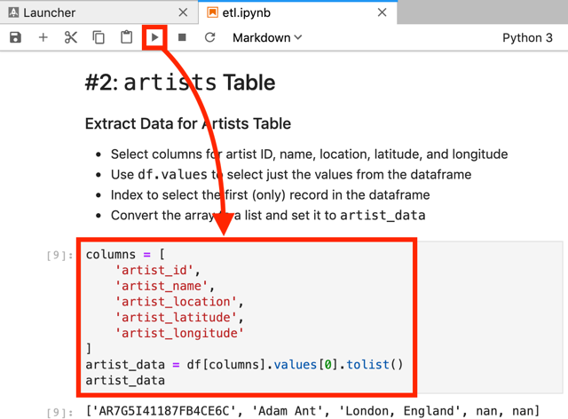

# Project: Data Modeling with Cassandra<a name="home"></a>

A startup called Sparkify wants to analyze the data they've been collecting on songs and user activity on their new music streaming app. The analysis team is particularly interested in understanding what songs users are listening to. Currently, there is no easy way to query the data to generate the results, since the data reside in a directory of CSV files on user activity on the app.

They'd like a data engineer to create an Apache Cassandra database which can create queries on song play data to answer the questions, and wish to bring you on the project. Your role is to create a database for this analysis. You'll be able to test your database by running queries given to you by the analytics team from Sparkify to create the results.

## Table of contents

- [Structure](#structure)
- [Requirements](#requirements)
- [How to use](#how-to-use)
  - [Cloning the repository](#cloning-the-repository)
  - [Creating the virtual environment](#creating-the-virtual-environment)
  - [Running Cassandra](#running-cassandra)
  - [Notebooks](#notebooks)

## Structure<a name="structure"></a>

This tree shows the repository structure. Only the project's main files are described.

```
.
├── images
├── src
│   ├── event_data           # Event files sample
│   ├── etl.ipynb            # Notebook to test the ETL pipeline
│   └── event_data_new.csv   # Aggregate events data
├── .editorconfig
├── .gitignore
├── README.md
└── requirements.txt
```

## Requirements<a name="requirements"></a>

It is assumed that the tools below are properly installed locally:

- [Python](https://www.python.org/) is a programming language that lets you work quickly and integrate systems more effectively. Versión 3.x is required.
- [pip](https://pip.pypa.io/en/stable/) is the package installer for Python.
- [Virtualenv](https://virtualenv.pypa.io/en/latest/) is a tool to create isolated Python environments.
- [Docker Engine / Desktop](https://hub.docker.com/search/?type=edition&offering=community) powers millions of applications worldwide, providing a standardized packaging format for diverse applications.

## How to use<a name="how-to-use"></a>

Here are listed the steps to run the ETL notebook of the project.

### Cloning the repository<a name="cloning-the-repository"></a>

The first step is to clone this repository. Just type the following command in your Terminal:

```bash
# Clone the repository...
git clone https://github.com/vermicida/data-modeling-cassandra.git

# ...and move to its directory
cd data-modeling-cassandra
```

### Creating the virtual environment<a name="creating-the-virtual-environment"></a>

Once the project is cloned, you must create a new virtual environment for it. You may have multiple Python versions installed, so it's important to specify the correct one with the `--python` argument. The code on this repository has been successfully tested over Python 3.6, but it must work on any Python 3 version; set the version that applies to your case in the following commands:

```bash
# Create the virtual environment...
virtualenv --python python3.6 project-env

# ...and activate it
source project-env/bin/activate
```

It's time to install the project's dependencies. You will use `pip` to do this job:

```bash
pip install -r requirements.txt
```

It may take awhile, be patient.

### Running Apache Cassandra<a name="running-cassandra"></a>

You can lean on Docker to run Apache Cassandra instead of install it. The available versions are described in the [cassandra site](https://hub.docker.com/_/cassandra) on Docker Hub: the latest stable version is `3.11.4` to this day (july 2019).

These are the arguments you must pass to `docker run` command in order to run the `cassandra` container:

- `-v $(pwd)/db:/var/lib/cassandra` sets a volume to persist the data.
- `-p 9042:9042` exposes the port 9042 to enable connections to the database.
- `--name cassandra` sets the container's name.
- `--rm` sets the flag to auto remove the container on stop.
- `-d` runs the container in background.

Let's make it work!

```bash
# Move to the directory src...
cd src

# ...and create a new one called db
mkdir db
````

And now, start the Apache Cassandra instance:

```bash
docker run -v $(pwd)/db:/var/lib/cassandra \
           -p 9042:9042 \
           --name cassandra \
           --rm \
           -d \
           cassandra:3.11.4
```

The container takes a few seconds to initialize. Check the logs to know when it's alive and ready:

```bash
# See the container logs...
docker logs cassandra

# ...in search of its readiness
INFO  [main] 2019-07-13 17:33:13,015 Server.java:156 - Starting listening for CQL clients on /0.0.0.0:9042 (unencrypted)...
INFO  [main] 2019-07-13 17:33:13,137 CassandraDaemon.java:556 - Not starting RPC server as requested. Use JMX (StorageService->startRPCServer()) or nodetool (enablethrift) to start it
INFO  [OptionalTasks:1] 2019-07-13 17:33:14,537 CassandraRoleManager.java:356 - Created default superuser role 'cassandra'
```

### Notebooks<a name="notebooks"></a>

It's time to run [JupyterLab](https://jupyterlab.readthedocs.io/en/stable/getting_started/overview.html). But first, let's see the arguments you will use:

- `--port=8888` exposes the port 8888 to enable connections from a browser.
- `--notebook-dir=$(pwd)` sets the current directory (`src`) as the the JupyterLab's working directory.

Ready? Run this command:

```bash
jupyter lab --port=8888 --notebook-dir=$(pwd)
```

This will open a new tab in your browser with the JupyterLab's webapp. Double-click the file `etl.ipynb`, at the file explorer shown in the left side of the window. This notebook can be used to test the ETL pipeline defined for the use case commented [at the beginning](#home). Just use the `play` button to run the cells one by one.



Once you have gone thru all the cells, shutdown the current kernel and close de notebook. There is no need to keep JupyterLab running, so stop it using `ctrl + c` command; type `y` when it prompts to you about the shutdown:

```bash
# Answer with 'y'.
Shutdown this notebook server (y/[n])?
```
